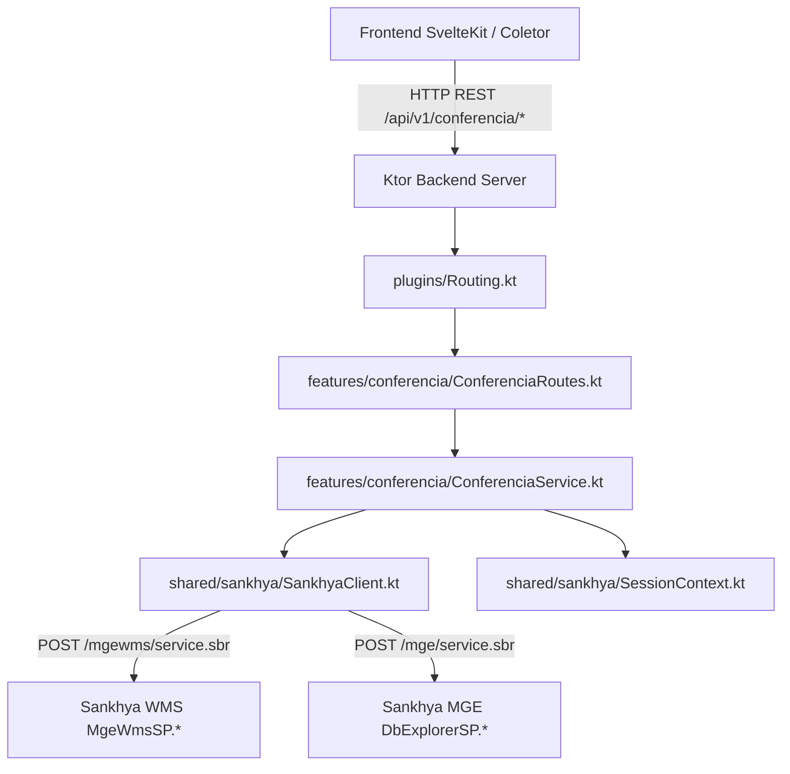

# Especificação Técnica: Migração dos Endpoints da Tela de Conferência para Ktor

## Resumo Executivo

Esta especificação técnica orienta a implementação da migração de todos os 13 endpoints REST consumidos pela interface de conferência de expedição (`src/routes/expedicao/components/conferencia` e `src/routes/api/conferencia`) para o backend dedicado em Kotlin/Ktor (`backend/`).

A implementação adotará o padrão de **Fatiamento Vertical (Package-by-Feature)** no pacote `backend/src/main/kotlin/com/snk/conferencia/features/conferencia/`. A comunicação com o ERP Sankhya reutilizará a infraestrutura compartilhada `SankhyaClient` (`shared/sankhya/SankhyaClient.kt`), disparando as rotas WMS (`MgeWmsSP.buscaConferenciaPorPedido`, `MgeWmsSP.insereItemConferidoColetor`, `MgeWmsSP.produtosConferidos`, `MgeWmsSP.registraEtiquetasVolume`, `MgeWmsSP.liberaCheckoutDoca`, `MgeWmsSP.cancelaTarefa`, `MgeWmsSP.buscarTarefasColetor`, `MgeWmsSP.itensConferencia`, `MgeWmsSP.obtemDescricaoProduto`, `MgeWmsSP.limpaConferenciaColetor`) e `DbExplorerSP.executeQuery` para `ViewAppSeparacao`.

O tratamento de exceções utilizará o plugin `StatusPages` e a classe de exceção `SankhyaBusinessException`, garantindo que respostas de falhas do gateway Sankhya sejam retornadas com status `HTTP 400 Bad Request` e contrato unificado `ErrorResponseDto`.

## Arquitetura do Sistema

### Visão Geral dos Componentes

1. **`features/conferencia/` (Expandido)**
   - `ConferenciaRoutes.kt`: Declaração e roteamento das 13 rotas de conferência em `/api/v1/conferencia`.
   - `ConferenciaService.kt` / `ConferenciaServiceImpl.kt`: Orquestração de regras de negócio, serialização JSON e chamadas de serviços Sankhya.
   - `ConferenciaDTOs.kt`: Definição de todos os data classes serializáveis para DTOs de entrada e saída.

2. **`shared/sankhya/` (Componente de Integração Reutilizável)**
   - `SankhyaClient.kt`: Cliente HTTP Ktor configurado para envio de requisições ao gateway Sankhya (`/mgewms/service.sbr` ou `/mge/service.sbr`) injetando `JSESSIONID` e tratando encoding `windows-1252`.
   - `SessionContext.kt`: Helper de extração de credenciais (`call.extractSankhyaSession(jwtProvider)`).

3. **`plugins/` (Configurações Globais)**
   - `Routing.kt`: Registro da extensão `conferenciaRoutes(conferenciaService, jwtProvider)`.
   - `StatusPages.kt`: Mapeamento centralizado de `SankhyaBusinessException`, `IllegalArgumentException` e `ValidationException`.



## Design de Implementação

### Interfaces Principais

```kotlin
// features/conferencia/ConferenciaService.kt
package com.snk.conferencia.features.conferencia

interface ConferenciaServiceInterface {
    suspend fun buscarConferencia(baseUrl: String, jsessionid: String, request: BuscarConferenciaRequest): List<ConferenciaResponse>
    suspend fun iniciarConferencia(baseUrl: String, jsessionid: String, userId: Long, request: IniciarConferenciaRequest): List<IniciarConferenciaResponse>
    suspend fun buscarTarefasPendentes(baseUrl: String, jsessionid: String, userId: Long): List<ConferenciaPendenteResponse>
    suspend fun buscarItensConferencia(baseUrl: String, jsessionid: String, nroConferencia: Long): List<ItemConferenciaResponse>
    suspend fun obterInfoProduto(baseUrl: String, jsessionid: String, request: InfoProdutoRequest): InfoProdutoResponse
    suspend fun registrarItemConferido(baseUrl: String, jsessionid: String, userId: Long, request: RegistrarItemConferidoRequest): RegistrarItemResponse
    suspend fun atualizarSaldoItem(baseUrl: String, jsessionid: String, request: AtualizarSaldoRequest): List<SaldoItemResponse>
    suspend fun removerItens(baseUrl: String, jsessionid: String, request: RemoverItensRequest): Unit
    suspend fun finalizarConferencia(baseUrl: String, jsessionid: String, userId: Long, request: FinalizarConferenciaRequest): FinalizarConferenciaResponse
    suspend fun registrarVolumes(baseUrl: String, jsessionid: String, userId: Long, request: RegistrarVolumesRequest): Unit
    suspend fun imprimirVolumes(baseUrl: String, jsessionid: String, request: ImprimirVolumesRequest): String
    suspend fun enviarParaDoca(baseUrl: String, jsessionid: String, userId: Long, request: EnviarDocaRequest): Unit
    suspend fun cancelarConferencia(baseUrl: String, jsessionid: String, userId: Long, request: CancelarConferenciaRequest): Unit
}
```

### Modelos de Dados

```kotlin
// features/conferencia/ConferenciaDTOs.kt
package com.snk.conferencia.features.conferencia

import kotlinx.serialization.Serializable

@Serializable
data class BuscarConferenciaRequest(
    val checkout: String? = null,
    val nroConferencia: Long? = null
)

@Serializable
data class ConferenciaResponse(
    val nroConferencia: Long?,
    val nroSeparacao: Long,
    val nroUnico: Long,
    val nroNota: Long,
    val ordemCarga: Long?,
    val checkout: String?,
    val codDoca: Long?,
    val descrDoca: String?
)

@Serializable
data class IniciarConferenciaRequest(
    val checkout: String
)

@Serializable
data class IniciarConferenciaResponse(
    val nroConferencia: Long,
    val tipoConferencia: String,
    val sepAgrupada: String? = null,
    val volumeContinuo: String? = null,
    val impEtiquetaFechVol: String? = null
)

@Serializable
data class ConferenciaPendenteResponse(
    val nroConferencia: Long,
    val checkout: String?,
    val nroSeparacao: Long
)

@Serializable
data class ItemConferenciaResponse(
    val codProduto: Long,
    val descrProduto: String,
    val codBarra: String?,
    val quantidade: Double,
    val qtdadeConferida: Double = 0.0,
    val qtdadeAvariada: Double = 0.0,
    val sequencias: List<Long> = emptyList(),
    val possuiDivergencia: Boolean = false
)

@Serializable
data class InfoProdutoRequest(
    val nroConferencia: Long,
    val codBarra: String,
    val quantidade: Double
)

@Serializable
data class InfoProdutoResponse(
    val codProduto: Long,
    val descrProduto: String,
    val complemento: String? = null,
    val pesoBruto: Double? = null
)

@Serializable
data class RegistrarItemConferidoRequest(
    val nroConferencia: Long,
    val codBarra: String,
    val quantidade: Double,
    val qtdadeAvariada: Double = 0.0,
    val nroVolume: Int? = null,
    val codCaixa: String? = null,
    val modoEdicao: String = "N",
    val volumeContinuo: String = "N"
)

@Serializable
data class RegistrarItemResponse(
    val status: String = "OK"
)

@Serializable
data class AtualizarSaldoRequest(
    val nroConferencia: Long,
    val codBarra: String? = null,
    val codProduto: Long? = null
)

@Serializable
data class SaldoItemResponse(
    val codProduto: Long,
    val qtdadeConferida: Double,
    val sequencias: List<Long>,
    val qtdadeAvariada: Double,
    val possuiDivergencia: Boolean
)

@Serializable
data class RemoverItensRequest(
    val nroConferencia: Long,
    val sequencias: List<Long>? = null
)

@Serializable
data class FinalizarConferenciaRequest(
    val nroConferencia: Long
)

@Serializable
data class FinalizarConferenciaResponse(
    val nroConferencia: Long,
    val status: String,
    val mensagem: String? = null
)

@Serializable
data class RegistrarVolumesRequest(
    val nroConferencia: Long,
    val quantidade: Int
)

@Serializable
data class ImprimirVolumesRequest(
    val nroUnico: Long? = null,
    val nroSeparacao: Long? = null,
    val quantidade: Int? = null
)

@Serializable
data class EnviarDocaRequest(
    val nroConferencia: Long,
    val nroNota: Long,
    val ordemCarga: Long? = null
)

@Serializable
data class CancelarConferenciaRequest(
    val nroConferencia: Long
)
```

### Endpoints de API

Abaixo a lista completa dos 13 endpoints sob `/api/v1/conferencia`:

1. `POST /api/v1/conferencia/search`
   - Body: `BuscarConferenciaRequest`
   - Response: `200 OK` -> `List<ConferenciaResponse>`
2. `POST /api/v1/conferencia/iniciar`
   - Body: `IniciarConferenciaRequest`
   - Response: `200 OK` -> `List<IniciarConferenciaResponse>`
3. `GET /api/v1/conferencia/pendentes`
   - Response: `200 OK` -> `List<ConferenciaPendenteResponse>`
4. `POST /api/v1/conferencia/itens`
   - Body: `{ "nroConferencia": Long }`
   - Response: `200 OK` -> `List<ItemConferenciaResponse>`
5. `POST /api/v1/conferencia/info`
   - Body: `InfoProdutoRequest`
   - Response: `200 OK` -> `InfoProdutoResponse`
6. `POST /api/v1/conferencia/registrar`
   - Body: `RegistrarItemConferidoRequest`
   - Response: `200 OK` -> `RegistrarItemResponse`
7. `POST /api/v1/conferencia/itens/saldo`
   - Body: `AtualizarSaldoRequest`
   - Response: `200 OK` -> `List<SaldoItemResponse>`
8. `POST /api/v1/conferencia/remover-itens`
   - Body: `RemoverItensRequest`
   - Response: `200 OK` -> `{ "message": "Itens removidos com sucesso" }`
9. `POST /api/v1/conferencia/finalizar`
   - Body: `FinalizarConferenciaRequest`
   - Response: `200 OK` -> `FinalizarConferenciaResponse`
10. `POST /api/v1/conferencia/volumes`
    - Body: `RegistrarVolumesRequest`
    - Response: `200 OK` -> `{ "message": "Volumes registrados com sucesso" }`
11. `POST /api/v1/conferencia/volumes/imprimir`
    - Body: `ImprimirVolumesRequest`
    - Response: `200 OK` -> Retorno de texto/HTML de impressão
12. `POST /api/v1/conferencia/doca`
    - Body: `EnviarDocaRequest`
    - Response: `200 OK` -> `{ "message": "Conferência enviada para a doca" }`
13. `POST /api/v1/conferencia/cancelar`
    - Body: `CancelarConferenciaRequest`
    - Response: `200 OK` -> `{ "message": "Conferência cancelada" }`

## Pontos de Integração

- **Gateway ERP Sankhya (`POST /mgewms/service.sbr` e `/mge/service.sbr`)**:
  - Encapsulado em `SankhyaClient.kt`.
  - Tratamento de encoding `windows-1252` para mensagens e descrições do WMS.
  - Conversão de falhas de status do gateway (`status != "1"`) em `SankhyaBusinessException` mapeada via `StatusPages` para HTTP `400 Bad Request`.
  - Sessão extraída via `call.extractSankhyaSession(jwtProvider)`.

## Abordagem de Testes

### Testes de Integração
- **Escopo**: Cobertura das rotas da conferência em `ConferenciaRoutesTest.kt` utilizando o framework `testApplication` do Ktor.
- **Estratégia**: Mocar as chamadas de serviço em `ConferenciaServiceInterface` e injetar um `JwtProvider` de teste.
- **Cenários Cobertos**:
  - Envio de JSONs válidos e inválidos em cada uma das 13 rotas.
  - Verificação de headers `Authorization: Bearer <jwt>`.
  - Retornos de status HTTP semânticos (200 OK, 400 Bad Request, 401 Unauthorized, 500 Internal Server Error).

## Sequenciamento de Desenvolvimento

1. **DTOs e Interface (`ConferenciaDTOs.kt` & `ConferenciaService.kt`)**: Definir os modelos de dados e contrato do serviço.
2. **Serviço de Negócio (`ConferenciaServiceImpl.kt`)**: Implementar a lógica de tradução de chamadas para o `SankhyaClient`.
3. **Roteamento (`ConferenciaRoutes.kt` & `Routing.kt`)**: Registrar os 13 endpoints REST e expor via Ktor Routing.
4. **Testes de Integração (`ConferenciaRoutesTest.kt`)**: Implementar suite de testes em `testApplication`.

## Monitoramento e Observabilidade

- **Métricas**: Rastreamento de latência e contadores via Ktor Metrics / Prometheus (`/metrics`).
- **Logs**: Uso de Slf4j / Logback mascarando dados de autenticação e registrando operações de conferência (início, bipagem, cancelamento e doca) em nível `INFO`.

## Considerações Técnicas

### Decisões Principais

1. **Padrão Package-by-Feature (`features/conferencia`)**:
   - *Decisão*: Agrupar DTOs, Rotas e Serviços no pacote `features.conferencia`.
   - *Justificativa*: Seguir estritamente a arquitetura do projeto existente conforme adotado nas features `separacao` e `lookup`.
2. **Tratamento de Exceções Unificado**:
   - *Decisão*: Utilizar `SankhyaBusinessException` para falhas do ERP, gerando `HTTP 400` padronizado.
   - *Justificativa*: Garante padronização e previsibilidade de resposta em todas as chamadas.

### Arquivos Relevantes

- `tasks/prd-migracao-backend-conferencia/prd.md`
- `tasks/prd-migracao-backend-conferencia/techspec.md`
- `backend/src/main/kotlin/com/snk/conferencia/features/conferencia/ConferenciaRoutes.kt`
- `backend/src/main/kotlin/com/snk/conferencia/features/conferencia/ConferenciaService.kt`
- `backend/src/main/kotlin/com/snk/conferencia/features/conferencia/ConferenciaDTOs.kt`
- `backend/src/main/kotlin/com/snk/conferencia/shared/sankhya/SankhyaClient.kt`
- `backend/src/main/kotlin/com/snk/conferencia/plugins/StatusPages.kt`
- `backend/src/main/kotlin/com/snk/conferencia/plugins/Routing.kt`
- `backend/src/test/kotlin/com/snk/conferencia/features/conferencia/ConferenciaRoutesTest.kt`
