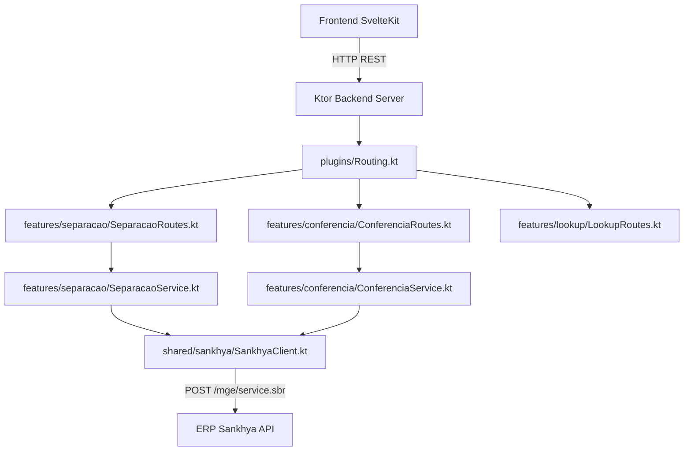

# Especificação Técnica: Migração dos Endpoints da Tela de Separações para Ktor

## Resumo Executivo

Esta especificação técnica detalha a implementação da migração dos endpoints REST consumidos pela interface de busca e gestão de separações (`src/routes/expedicao/components/separacoes`) para o backend em Kotlin/Ktor (`backend/`). 

A arquitetura adotará a estratégia de **Fatiamento Vertical (Package-by-Feature)** dividida em três módulos principais em `backend/src/main/kotlin/com/snk/conferencia/features/`: `separacao`, `conferencia` e `lookup`. A integração com o ERP Sankhya será realizada via um cliente HTTP dedicado Ktor invocando os serviços nativos do gateway (`MobileLoginSP.login`, `DbExplorerSP.executeQuery`, `CRUDServiceProvider.saveRecord`). O tratamento de exceções utilizará o plugin `StatusPages` para retornar respostas REST semânticas com códigos de status HTTP padrão (200, 200/201, 400, 401, 404, 500).

## Arquitetura do Sistema

### Visão Geral dos Componentes

1. **`features/separacao/` (Novo Componente)**
   - `SeparacaoRoutes.kt`: Define as rotas Ktor para busca de separações, itens e cálculo/geração de volumes.
   - `SeparacaoService.kt`: Implementa a lógica de negócio e montagem das consultas para a View `ViewAppSeparacao` do ERP.
   - `SeparacaoDTOs.kt`: Agrupa os data classes de requisição e resposta para buscas, itens e volumes.

2. **`features/conferencia/` (Novo Componente)**
   - `ConferenciaRoutes.kt`: Define as rotas Ktor para ações de expedição (envio para doca, cancelamento e solicitação de impressão).
   - `ConferenciaService.kt`: Orquestra a execução das ações no ERP Sankhya.
   - `ConferenciaDTOs.kt`: Agrupa os DTOs de requisição/resposta para doca, cancelamento e impressão.

3. **`features/lookup/` (Novo Componente)**
   - `LookupRoutes.kt` & `LookupService.kt`: Fornece endpoints autocompletar para entidades compartilhadas (Empresa, Parceiro, Produto).

4. **`shared/sankhya/` (Componente de Integração Reutilizável)**
   - `SankhyaClient.kt`: Cliente HTTP encapsulado para envio de requisições ao gateway Sankhya (`/mge/service.sbr`) injetando o `jsessionid` e gerenciando autenticação.

5. **`plugins/` (Configurações do Ktor Modificadas/Existentes)**
   - `Routing.kt`: Registra as extensões de rotas das features `separacaoRoutes()`, `conferenciaRoutes()` e `lookupRoutes()`.
   - `StatusPages.kt`: Mapeia exceções de domínio e do gateway para respostas HTTP padronizadas.



## Design de Implementação

### Interfaces Principais

```kotlin
// features/separacao/SeparacaoService.kt
package com.snk.conferencia.features.separacao

interface SeparacaoService {
    suspend fun buscarSeparacoes(filtros: SeparacaoFilterRequest): List<SeparacaoResponse>
    suspend fun buscarItens(nroSeparacao: Long): List<ItemSeparacaoResponse>
    suspend fun obterQuantidadeVolumes(nroSeparacao: Long): QuantidadeVolumesResponse
    suspend fun gerarVolumes(nroSeparacao: Long): GerarVolumesResponse
}
```

```kotlin
// features/conferencia/ConferenciaService.kt
package com.snk.conferencia.features.conferencia

interface ConferenciaService {
    suspend fun enviarParaDoca(request: EnviarDocaRequest): Unit
    suspend fun cancelarConferencia(request: CancelarConferenciaRequest): Unit
    suspend fun imprimirVolumes(request: ImprimirVolumesRequest): Unit
}
```

### Modelos de Dados

```kotlin
// features/separacao/SeparacaoDTOs.kt
package com.snk.conferencia.features.separacao

import kotlinx.serialization.Serializable

@Serializable
data class SeparacaoFilterRequest(
    val empresa: Long? = null,
    val parceiro: Long? = null,
    val dataInicio: String? = null,
    val dataFim: String? = null,
    val nroSeparacao: Long? = null,
    val nroUnico: Long? = null,
    val nroPedido: Long? = null,
    val ordemCarga: Long? = null,
    val produto: Long? = null,
    val situacao: List<Int>? = null
)

@Serializable
data class SeparacaoResponse(
    val nroSeparacao: Long,
    val nroConferencia: Long?,
    val nroUnico: Long,
    val nroPedido: Long,
    val codEmp: Long,
    val nomeEmpresa: String,
    val codParc: Long,
    val nomeParceiro: String,
    val dtSeparacao: String,
    val codSit: Int,
    val descrSit: String,
    val ordemCarga: Long?,
    val enviadoParaDoca: Boolean
)

@Serializable
data class ItemSeparacaoResponse(
    val codProd: Long,
    val descrProd: String,
    val codVol: String,
    val qtdNeg: Double,
    val referencia: String? = null
)

@Serializable
data class QuantidadeVolumesResponse(
    val nroSeparacao: Long,
    val quantidade: Int
)

@Serializable
data class GerarVolumesResponse(
    val nroSeparacao: Long,
    val status: String,
    val mensagem: String
)
```

```kotlin
// features/conferencia/ConferenciaDTOs.kt
package com.snk.conferencia.features.conferencia

import kotlinx.serialization.Serializable

@Serializable
data class EnviarDocaRequest(
    val nroConferencia: Long,
    val nroNota: Long,
    val ordemCarga: Long? = null
)

@Serializable
data class CancelarConferenciaRequest(
    val nroConferencia: Long,
    val codSit: Int
)

@Serializable
data class ImprimirVolumesRequest(
    val nroUnico: Long,
    val nroSeparacao: Long
)
```

### Endpoints de API

#### 1. Módulo `separacao`
- `POST /api/v1/separacoes/search`: Busca filtrada de separações.
  - Body: `SeparacaoFilterRequest`
  - Resposta: `200 OK` -> `List<SeparacaoResponse>`
- `GET /api/v1/separacoes/{nroSeparacao}/itens`: Consulta de produtos da separação.
  - Resposta: `200 OK` -> `List<ItemSeparacaoResponse>`
- `GET /api/v1/separacoes/{nroSeparacao}/volumes/quantidade`: Quantidade de volumes calculados.
  - Resposta: `200 OK` -> `QuantidadeVolumesResponse`
- `POST /api/v1/separacoes/{nroSeparacao}/volumes`: Geração oficial de volumes.
  - Resposta: `201 Created` / `200 OK` -> `GerarVolumesResponse`

#### 2. Módulo `conferencia`
- `POST /api/v1/conferencia/doca`: Direcionamento para doca.
  - Body: `EnviarDocaRequest`
  - Resposta: `200 OK` -> `{ "message": "Enviado para a doca com sucesso" }`
- `POST /api/v1/conferencia/cancelar`: Cancelamento de conferência.
  - Body: `CancelarConferenciaRequest`
  - Resposta: `200 OK` -> `{ "message": "Conferência cancelada com sucesso" }`
- `POST /api/v1/conferencia/volumes/imprimir`: Solicitação de impressão.
  - Body: `ImprimirVolumesRequest`
  - Resposta: `200 OK` -> `{ "message": "Solicitação de impressão enviada" }`

#### 3. Módulo `lookup`
- `GET /api/v1/empresas`: Lista de empresas ativas.
- `GET /api/v1/parceiros?q={termo}`: Autocompletar de parceiros.
- `GET /api/v1/produtos?q={termo}`: Autocompletar de produtos.

## Pontos de Integração

- **Gateway ERP Sankhya (`POST https://{hostname}/mge/service.sbr`)**:
  - **Serviço `DbExplorerSP.executeQuery`**: Utilizado para carregar a View `ViewAppSeparacao` com cláusulas `WHERE` parametrizadas com sanitização estrita.
  - **Autenticação (`jsessionid`)**: Extraído da sessão do usuário autenticado no Ktor e repassado nos headers/cookies para a Sankhya API.
  - **Tratamento de Erros Sankhya**: Erros de negócio retornados pelo gateway (`status = 0`) serão traduzidos no Ktor para exceções customizadas (`SankhyaBusinessException`), respondendo HTTP `400 Bad Request` com mensagem informativa.

## Abordagem de Testes

### Testes Unidade
- **Escopo**: Validação individual dos métodos de `SeparacaoService` e `ConferenciaService`.
- **Estratégia**: Mocar o `SankhyaClient` com `MockEngine` do Ktor HTTP Client para simular payloads JSON de sucesso e erro do ERP Sankhya.
- **Cenários Críticos**:
  - Montagem de filtros dinâmicos sem parâmetros (deve lançar `IllegalArgumentException`).
  - Parsing de datas e conversão dos registros `record` retornados pela API Sankhya em `SeparacaoResponse`.
  - Mapeamento correto de exceções do gateway para o `StatusPages`.

### Testes de Integração
- **Escopo**: Teste dos endpoints de rotas Ktor (`SeparacaoRoutesTest.kt`, `ConferenciaRoutesTest.kt`) usando `testApplication`.
- **Validação**: Verificar cabeçalhos de resposta, autenticação JWT/Session, parsing de JSON do body e status HTTP retornados.

### Testes de E2E
- **Status**: Postergados / Fora de Escopo nesta etapa.
- **Justificativa**: A camada de frontend em SvelteKit/UI passará por reformulação posterior; os testes automatizados nesta fase focam 100% na garantia da API backend Ktor via unit/integration tests.

## Sequenciamento de Desenvolvimento

### Ordem de Construção

1. **Cliente Sankhya HTTP (`shared/sankhya/SankhyaClient.kt`)**: Implementar abstração base para comunicação com o gateway Sankhya.
2. **Feature Lookup (`features/lookup/`)**: Implementar endpoints de Empresas, Parceiros e Produtos (base para os filtros).
3. **Feature Separação (`features/separacao/`)**: Implementar DTOs, Service e Routes para busca de separações, itens e volumes.
4. **Feature Conferência (`features/conferencia/`)**: Implementar DTOs, Service e Routes para ações de doca, cancelamento e impressão.
5. **Configuração de Plugin `Routing.kt` & `StatusPages.kt`**: Conectar todas as novas rotas e manipuladores de exceções.
6. **Testes de Unidade e Integração**: Cobertura das regras e rotas no Ktor.

### Dependências Técnicas

- Acesso ao ambiente ERP Sankhya (ou mock do gateway em dev) para validação das Views e serviços `DbExplorerSP`.
- Gradle 9.6.1 e Kotlin 2.x ativos no projeto backend.

## Monitoramento e Observabilidade

- **Métricas Prometheus**:
  - `http_requests_total{route="/api/v1/separacoes/search", status="200"}`: Contagem de consultas.
  - `http_request_duration_seconds`: Histograma de latência das chamadas Ktor.
- **Logs Estruturados**:
  - Logback com filtro de sanitização (conforme `kotlin-ktor-security.md`) omitindo tokens/senhas.
  - Log de nível `INFO` para buscas e ações ativas (Docas, Cancelamentos).
  - Log de nível `ERROR` no `StatusPages` capturando falhas no gateway Sankhya sem expor stack trace para o cliente.

## Considerações Técnicas

### Decisões Principais

1. **Fatiamento Vertical Separado (`separacao` e `conferencia`)**:
   - *Decisão*: Manter duas fatias verticais distintas (`features/separacao/` e `features/conferencia/`).
   - *Justificativa*: Separa o contexto de leitura/consulta e geração de volumes do contexto de execução/alteração de estado de conferência (docas e cancelamento), melhorando o isolamento e manutenção por LLMs (skill `ktor-web-architecture`).
2. **Padrão REST Nativo no Ktor**:
   - *Decisão*: Substituir o wrapper legado `{ success: true, data: ... }` por códigos de status HTTP REST (200, 201, 400, 401, 500).
   - *Justificativa*: Adequação às boas práticas REST no Ktor e facilidade de integração com clientes HTTP modernos.
3. **Uso de HTTP Client para Sankhya Gateway**:
   - *Decisão*: Manter chamadas ao gateway Sankhya via HTTP Client interno ao invés de acesso direto ao banco.
   - *Justificativa*: Preserva as regras de negócio, triggers e tratamentos da View `ViewAppSeparacao` já homologada no ERP.

### Riscos Conhecidos

- **Latência do Gateway Sankhya**:
  - *Risco*: Consultas de separação sem período restrito podem gerar gargalo no ERP.
  - *Mitigação*: Validação obrigatória no `SeparacaoService` exigindo ao menos um filtro preenchido (`RF-03`).

### Conformidade com Padrões

Conformidade com as regras documentadas do repositório:
- `@.agents/rules/common.md`: Utilização da versão estável 9.6.1 do Gradle.
- `@.agents/rules/kotlin-ktor-security.md`: Sanitização de logs, validação de segurança JWT/Session, exceções com `StatusPages` sem expor stack traces, prepared/parameterized queries.
- `@.agents/rules/project-structure.md`: Organização clara e desacoplada do projeto.
- `@.agents/rules/sankhya-api.md`: Formato padrão do gateway Sankhya (`serviceName`, `requestBody`, tratamento do `jsessionid`).
- `@.agents/skills/ktor-web-architecture`: Estrutura Package-by-Feature, DTOs em arquivo único por funcionalidade, arquivo de rotas enxuto com injeção de serviço.

### Arquivos Relevantes e Dependentes

- `tasks/prd-migracao-endpoints-separacao/prd.md`
- `tasks/prd-migracao-endpoints-separacao/techspec.md`
- `backend/src/main/kotlin/com/snk/conferencia/Application.kt`
- `backend/src/main/kotlin/com/snk/conferencia/plugins/Routing.kt`
- `backend/src/main/kotlin/com/snk/conferencia/plugins/StatusPages.kt`
- `backend/src/main/kotlin/com/snk/conferencia/features/separacao/SeparacaoRoutes.kt`
- `backend/src/main/kotlin/com/snk/conferencia/features/separacao/SeparacaoService.kt`
- `backend/src/main/kotlin/com/snk/conferencia/features/separacao/SeparacaoDTOs.kt`
- `backend/src/main/kotlin/com/snk/conferencia/features/conferencia/ConferenciaRoutes.kt`
- `backend/src/main/kotlin/com/snk/conferencia/features/conferencia/ConferenciaService.kt`
- `backend/src/main/kotlin/com/snk/conferencia/features/conferencia/ConferenciaDTOs.kt`
- `backend/src/main/kotlin/com/snk/conferencia/features/lookup/LookupRoutes.kt`
- `src/lib/states/separacao.svelte.ts`
