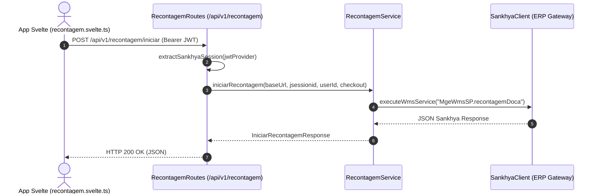

# Especificação Técnica: Migração da API de Recontagem para Ktor Backend

## Resumo Executivo

Esta especificação técnica detalha a implementação para migrar os 6 endpoints do módulo de **Recontagem** do frontend SvelteKit (`src/routes/api/recontagem`) para o backend em Kotlin Ktor (`backend/`). A solução adota o padrão de arquitetura por funcionalidade (*Package-by-Feature*), criando o pacote `com.snk.conferencia.features.recontagem` espelhando a estrutura do módulo de Conferência existente.

O serviço `RecontagemService` intermediará a comunicação com os serviços WMS do ERP Sankhya (`MgeWmsSP.recontagemDoca`, `MgeWmsSP.proximaRecontagem`, `MgeWmsSP.buscaInfoProduto`, `MgeWmsSP.envioRecontagem`, `MgeWmsSP.rejeitaTarefa`, `MgeWmsSP.buscaInfoRecontagem`) via `SankhyaClient`. Toda a segurança e extração de sessão Sankhya utilizarão a validação JWT já presente no Ktor.

## Arquitetura do Sistema

### Visão Geral dos Componentes

- **`RecontagemRoutes` (`backend/src/main/kotlin/com/snk/conferencia/features/recontagem/RecontagemRoutes.kt`):** Expõe os endpoints HTTP em `/api/v1/recontagem`, valida payloads de entrada e extrai a sessão Sankhya (`call.extractSankhyaSession`).
- **`RecontagemServiceInterface` / `RecontagemService` (`backend/src/main/kotlin/com/snk/conferencia/features/recontagem/RecontagemService.kt`):** Implementa as regras de negócio de recontagem, construindo requisições Sankhya, interpretando respostas, tratando o erro `WMS_E00299` como finalização graciosa e lançando `SankhyaBusinessException` quando necessário.
- **`RecontagemDTOs` (`backend/src/main/kotlin/com/snk/conferencia/features/recontagem/RecontagemDTOs.kt`):** Classes serializáveis (`@Serializable`) que definem requisições e respostas fortemente tipadas para o cliente Svelte.
- **`SankhyaClient` (`shared/sankhya/SankhyaClient.kt`):** Cliente de comunicação HTTP de baixo nível com o gateway Sankhya WMS.
- **`StatusPages` (`plugins/StatusPages.kt`):** Middleware de captura centralizada de exceções que formata respostas de erro HTTP 400/500 uniformes.
- **`Routing` (`plugins/Routing.kt`):** Registra as rotas da funcionalidade na aplicação Ktor.



## Design de Implementação

### Interfaces Principais

```kotlin
package com.snk.conferencia.features.recontagem

interface RecontagemServiceInterface {
    suspend fun iniciarRecontagem(baseUrl: String, jsessionid: String, userId: Long, checkout: String): IniciarRecontagemResponse
    suspend fun buscarProximaRecontagem(baseUrl: String, jsessionid: String, userId: Long, request: ProximaRecontagemRequest): ItemRecontagemResponse?
    suspend fun obterInfoProduto(baseUrl: String, jsessionid: String, userId: Long, request: InfoProdutoRecontagemRequest): Any
    suspend fun enviarRecontagem(baseUrl: String, jsessionid: String, userId: Long, request: EnviarRecontagemRequest): Any
    suspend fun cancelarRecontagem(baseUrl: String, jsessionid: String, userId: Long, request: CancelarRecontagemRequest): RecontagemActionResponse
    suspend fun obterInfoRecontagem(baseUrl: String, jsessionid: String, userId: Long, checkout: String): Any
}
```

### Modelos de Dados

```kotlin
package com.snk.conferencia.features.recontagem

import kotlinx.serialization.Serializable

@Serializable
data class IniciarRecontagemRequest(
    val checkout: String
)

@Serializable
data class IniciarRecontagemResponse(
    val nroConferencia: Long,
    val nroTarefa: Long,
    val nroUnico: Long,
    val nroNota: Long,
    val ordemCarga: Long,
    val codigoEndereco: Long,
    val codigoUsuario: Long,
    val separador: String,
    val tipoConferencia: String
)

@Serializable
data class ProximaRecontagemRequest(
    val nroConferencia: Long,
    val nroTarefa: Long,
    val codigoEndereco: Long
)

@Serializable
data class ItemRecontagemResponse(
    val nroConferencia: Long,
    val nroTarefa: Long,
    val codigoProduto: Long,
    val descricaoProduto: String,
    val sequencia: Long,
    val codigoBarras: String? = null,
    val codigoEndereco: Long,
    val controle: String? = null,
    val usaControle: String? = null,
    val primeiraRecontagem: Long,
    val tipoRecebimento: String? = null,
    val conferido: Boolean = false
)

@Serializable
data class InfoProdutoRecontagemRequest(
    val nroConferencia: Long,
    val codigoBarras: String,
    val quantidade: Double
)

@Serializable
data class EnviarRecontagemRequest(
    val nroConferencia: Long,
    val nroTarefa: Long,
    val codigoBarras: String,
    val quantidade: Double,
    val sequencia: Long
)

@Serializable
data class CancelarRecontagemRequest(
    val nroTarefa: Long,
    val sequencia: Long
)

@Serializable
data class RecontagemActionResponse(
    val status: String = "1",
    val mensagem: String = "Sucesso"
)
```

### Endpoints de API

- `POST /api/v1/recontagem/iniciar`
  - **Descrição:** Inicia a recontagem para o checkout informado (`MgeWmsSP.recontagemDoca`).
  - **Payload:** `IniciarRecontagemRequest`
  - **Resposta:** `IniciarRecontagemResponse` (HTTP 200 OK)

- `POST /api/v1/recontagem/proxima`
  - **Descrição:** Consulta o próximo item da tarefa de recontagem (`MgeWmsSP.proximaRecontagem`). Trata `WMS_E00299` retornando `null`.
  - **Payload:** `ProximaRecontagemRequest`
  - **Resposta:** `ItemRecontagemResponse?` (HTTP 200 OK)

- `POST /api/v1/recontagem/info-produto`
  - **Descrição:** Consulta detalhes do produto a partir do código de barras e quantidade (`MgeWmsSP.buscaInfoProduto`).
  - **Payload:** `InfoProdutoRecontagemRequest`
  - **Resposta:** JSON com objeto de linha do produto (HTTP 200 OK)

- `POST /api/v1/recontagem/enviar`
  - **Descrição:** Envia o resultado da contagem física (`MgeWmsSP.envioRecontagem`). Lanço erro se `MENSAGEM != 'OK'`.
  - **Payload:** `EnviarRecontagemRequest`
  - **Resposta:** JSON de confirmação (HTTP 200 OK)

- `POST /api/v1/recontagem/cancelar`
  - **Descrição:** Cancela/rejeita a tarefa de recontagem (`MgeWmsSP.rejeitaTarefa`).
  - **Payload:** `CancelarRecontagemRequest`
  - **Resposta:** `RecontagemActionResponse` (HTTP 200 OK)

- `POST /api/v1/recontagem/info`
  - **Descrição:** Obtém dados gerais da recontagem pelo checkout (`MgeWmsSP.buscaInfoRecontagem`).
  - **Payload:** `IniciarRecontagemRequest`
  - **Resposta:** JSON com estado da recontagem (HTTP 200 OK)

## Pontos de Integração

- **Sankhya WMS Gateway:**
  - Endpoint de integração: `${baseUrl}/mgewms/service.sbr`
  - Parâmetros da Query: `serviceName=<SERVICO>&mgeSession=<JSESSIONID>&outputType=json`
  - Header Obligatório: `Cookie: JSESSIONID=<JSESSIONID>`
  - Codificação de Usuário: ID do usuário Sankhya convertido em Base64 no nó `<idusu><$></$></idusu>`.

- **Tratamento de Erros Sankhya:**
  - Respostas com `status != 1` lançam `SankhyaBusinessException(statusMessage)`.
  - Exceção para código `tsError.tsErrorCode == 'WMS_E00299'` em `proximaRecontagem`, mapeada para retorno HTTP 200 com payload nulo.

## Abordagem de Testes

### Testes Unidade
- **`RecontagemServiceTest`:**
  - Mock de `SankhyaClient` simulando retornos JSON válidos do Sankhya.
  - Teste do encadeamento dos 6 métodos de serviço.
  - Validação do tratamento do erro `WMS_E00299` (retornando `null`).
  - Validação de lançamento de `SankhyaBusinessException` para `MENSAGEM != 'OK'` no envio da recontagem.

### Testes de Integração
- **`RecontagemRoutesTest`:**
  - Utilização do `withTestApplication` / Ktor Test Engine.
  - Verificação de autenticação JWT nas rotas `/api/v1/recontagem/*`.
  - Asserção dos status HTTP 200 OK e 400 Bad Request para payloads inválidos.

### Testes de E2E
- **Playwright Frontend / Backend Integration:**
  - Execução dos testes automatizados E2E simulando a jornada completa da recontagem no app Svelte enviando requisições ao backend Ktor.

## Sequenciamento de Desenvolvimento

### Ordem de Construção

1. **Criação dos DTOs e Interfaces (`RecontagemDTOs.kt`, `RecontagemService.kt`):** Define os contratos de entrada/saída serializáveis e a abstração do serviço.
2. **Implementação da Camada de Serviço (`RecontagemService.kt`):** Codifica a chamada aos serviços Sankhya WMS via `SankhyaClient` e regras de tratamento.
3. **Criação das Rotas HTTP (`RecontagemRoutes.kt`):** Implementa os endpoints Ktor com extração de sessão JWT.
4. **Registro de Rotas no Ktor (`Routing.kt`, `Application.kt`):** Acopla o módulo na pipeline de roteamento global.
5. **Implementação dos Testes (`RecontagemServiceTest`, `RecontagemRoutesTest`):** Garante cobertura de código e testes automatizados.
6. **Atualização da Documentação (`documentation.yaml` / Swagger):** Atualiza as especificações de OpenAPI.
7. **Atualização do Frontend Svelte (`recontagem.svelte.ts`):** Aponta a URL dos endpoints de `/api/recontagem/*` para `/api/v1/recontagem/*`.

### Dependências Técnicas

- Servidor Sankhya WMS acessível para testes de integração de ambiente.
- Versão do Gradle mantida estritamente em **9.6.1**.

## Monitoramento e Observabilidade

- **Logs de Servidor (SLF4J / Logback):**
  - Registro de requisições de recontagem via `StatusPages` e `CallLogging`.
  - Mascaramento/sanitização de cookies `JSESSIONID` e tokens `Authorization`.
- **Métricas Ktor:**
  - Exposição de latência e contagem de requisições por rota em formato Prometheus em `/metrics`.

## Considerações Técnicas

### Decisões Principais

- **Manutenção de Padronização com Conferência:** Adotou-se exatamente o mesmo padrão de pacotes, rotas e injeção de dependências do módulo `conferencia` já consolidado na aplicação.
- **Tratamento Backend para `WMS_E00299`:** A complexidade da regra Sankhya que indica o término das tarefas é encapsulada na camada de serviço Kotlin para evitar vazamento de regras de fornecedor ERP no frontend.

### Riscos Conhecidos

- **Alterações nos Schemas Sankhya WMS:** Campos específicos como `CODBARRASCONCATWMS` ou `UTILIZAEXPLOTE` exigem envio com valores default exatos para evitar rejeição no ERP.

### Conformidade com Padrões

- `@.agents/rules/common.md`: Gradle 9.6.1 mantido, Swagger e README.md atualizados.
- `@.agents/rules/kotlin-ktor-security.md`: JWT verificado, sem credenciais hardcoded, captura de exceções via `StatusPages`.
- `@.agents/rules/sankhya-api.md`: Payload padronizado para chamadas do gateway Sankhya e codificação de usuário em Base64.

### Arquivos Relevantes e Dependentes

- `backend/src/main/kotlin/com/snk/conferencia/features/recontagem/RecontagemDTOs.kt`
- `backend/src/main/kotlin/com/snk/conferencia/features/recontagem/RecontagemRoutes.kt`
- `backend/src/main/kotlin/com/snk/conferencia/features/recontagem/RecontagemService.kt`
- `backend/src/main/kotlin/com/snk/conferencia/plugins/Routing.kt`
- `backend/src/main/resources/openapi/documentation.yaml`
- `backend/src/test/kotlin/com/snk/conferencia/features/recontagem/RecontagemServiceTest.kt`
- `backend/src/test/kotlin/com/snk/conferencia/features/recontagem/RecontagemRoutesTest.kt`
- `src/lib/states/recontagem.svelte.ts`
